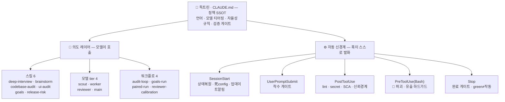

# ksi-claude-harness

**Claude Code로 "오래·자율·고위험" 개발을 돌리면서도, 자율성이 부르는 실패 — 가짜완료·비싼 오판·되돌리기 불가한 사고 — 를 구조로 막는 하네스.**

1인 개발자의 개인 `~/.claude` 하네스에서 **재사용 가능한 깨끗한 골격만** 추출했다 — 플러그인 + 마켓플레이스 + doctrine 템플릿(개인 메모리·비밀·세션은 제외).

> **한 줄 요약** — 모델에게 멀리 달리게 두되(ultracode·multi-agent), *"완료(green)"가 "실제 작동"을 뜻하도록* 검증 게이트를 코드로 박고, 되돌리기 불가한 명령엔 안전벨트를 채운 **trust-but-verify 스캐폴딩**.

---

## 왜 있나 — 목적

자율 에이전트가 오래 달리면 네 가지가 무너진다. 하네스는 각각을 **기능이 아니라 구조로** 막는다:

| 무너지는 것 | 하네스의 방어 |
|---|---|
| **"green ≠ 작동"** — 픽스처가 실제 흐름을 우회한 가짜 초록불, self-report "완료" | 완료 게이트(Stop 훅) · adversarial verify · goal-ledger 증거 게이트 |
| **비싼 오판** — 어려운 판단을 값싼 모델이, 잡일을 비싼 모델이 | 모델 티어링(haiku→sonnet→opus→main) — *틀린 tier의 재작업이 가장 비싼 토큰* |
| **되돌리기 불가 사고** — `rm -rf /` · force-push · `DROP DB` · 시크릿 유출 | PreToolUse 하드가드(모드 무관 **항상**) |
| **세션 간 기억 소실** — 매번 처음부터 재분석 | durable goal-ledger + 프로젝트 두뇌(`.ksi/`) |

핵심은 *"막는 시스템"*이 아니라 **"멀리 달리되, 틀린 채로·위험하게 달리지 않게 하는 시스템"**이다.

---

## 구조 한눈에

세 레이어다. **정책(독트린)**이 위에서 규범을 정하고, 그 아래 **의도 레이어**(모델이 필요할 때 *부르는* 것)와 **자동 신경계**(훅이 *스스로 발화*하는 것)가 나란히 돈다.



- **📜 독트린** = 되돌아볼 헌법. 모든 세션 컨텍스트에 로드돼 판단(어떤 tier·언제 확인·무엇을 검증)을 형성한다.
- **🧠 의도 레이어** = 모델이 상황에 맞게 *부르는* 도구. 강제되지 않고, 사용자 지시로 언제든 우회된다.
- **⚙️ 자동 신경계** = 잊을 수 없는 반사. 생명주기 이벤트마다 훅이 스스로 발화한다(아래 표).

---

## 3 레이어 상세

### 📜 정책 · 독트린 — `templates/`
전역 CLAUDE.md는 플러그인이 심을 수 없어 **직접 복사**한다. 언어·ultracode·모델 티어링·자율성·검증 게이트 규범 + `## 도메인 불변식` SSOT 스캐폴딩(4 어뷰징 클래스 — codebase-audit 어뷰징 렌즈의 조준점).

### 🧠 의도 레이어 — `plugins/ksi-harness/`

**스킬 6** (`skills/`) — 모델이 상황에 맞게 호출하는 플레이북. 일부는 멀티에이전트 워크플로로 돈다.

| 스킬 | 역할 |
|---|---|
| `deep-interview` | 착수 전 의도·스코프 확정(UI면 UX 축·멀티액터면 어뷰징 축 포함) |
| `brainstorm` | 발산 → 군집 → 수렴 |
| `codebase-audit` | 백엔드 병렬 감사 + adversarial verify + critic 수렴 루프(어뷰징·무결성·운영조건 렌즈) |
| `ui-audit` | 프론트 **시각 + UX 플로우** 감사(뷰포트별 캡처를 다중 에이전트가 눈으로 검증) |
| `goals` | **durable goal-ledger** — 완료를 reviewer 증거 게이트로만 인정·조기완료 무효화/재오픈 |
| `release-risk` | 배포·마이그·롤백·blast-radius 리스크 점검(자율성 게이트 운영화) |

**모델 tier 4** (`agents/`) — 페르소나가 아니라 **비용·능력 레버**. 실패하면 한 단계 승급(haiku→sonnet→opus→main).

| tier | 모델 | 역할 |
|---|---|---|
| `scout` | Haiku | 탐색·기계적 잡일(코드 파일 수정 금지) |
| `worker` | Sonnet high | 명세를 따르는 구현·리팩터·테스트 |
| `reviewer` | Opus xhigh · **read-only** | 명세를 의심 — adversarial 반증·완성도 critic |
| `main` | 세션 최상위 모델 | 오케스트레이션·되돌리기 어려운 최종 판단(움직이는 천장이라 에이전트 없음) |

**워크플로 4** (`templates/workflows/`) — 결정론적 멀티에이전트 오케스트레이션.

| 워크플로 | 역할 |
|---|---|
| `audit-loop` | analyze fan-out → adversarial verify → critic 재투입 수렴 |
| `goals-run` | 원장 목표를 evidence-gate로만 자율 소진(red-lane은 사람에게) |
| `paired-run` | 새 모델 출시 때 "tier X가 렌즈 Z에서 tier Y를 대체하나" 싸게 검증 |
| `reviewer-calibration` | reviewer 러버스탬프 퇴화를 trap-set으로 능동 측정 |

### ⚙️ 자동 신경계 — 훅 (`scripts/` + `hooks/hooks.json`)

Claude Code의 **생명주기 이벤트마다** 훅이 스스로 발화한다. 성격은 셋: **🛑 하드 차단**(되돌리기 불가만) · **↩ 완료 게이트**(완료를 1회 막고 검증 요구) · **⚠ 넛지**(비차단 경고).

| 이벤트 | 훅 | 하는 일 | 성격 |
|---|---|---|---|
| **SessionStart** | `update-check` | 원격 릴리스 태그와 비교, 뒤처지면 알림 | 알림 |
| | `dead-config-guard` | 프로젝트 settings의 죽은 엔드포인트·모델 매핑 경고 | ⚠ |
| | `goal-status` | `.ksi` 원장 미완 goal·프로젝트 두뇌 복원 | ⚠ |
| **UserPromptSubmit** | `gate-nudge` | 새 기능·대형 리팩터면 착수 전 스코프 상기 | ⚠ |
| **PreToolUse**(Bash) | `pre-destructive-guard` | rm 루트/홈 · force-push · reset --hard · `DROP DB` 차단 | 🛑 |
| | `exfil-guard` | git push 시크릿 유출 차단 + outbound 유출 경고 | 🛑 |
| **PostToolUse**(편집) | `ruff-check` | `.py` 저장 시 lint | ⚠ |
| | `secret-scan` | 하드코딩 시크릿·파괴적 DDL 경고(편집분만 스캔) | ⚠ |
| | `sca-check` | 의존성 변경 시 pip-audit/npm audit 취약점 | ⚠ |
| **PostToolUse**(웹) | `trust-boundary-nudge` | WebFetch/Search 후 "웹콘텐츠 = 데이터" 상기 | ⚠ |
| **Stop**(완료 시도) | `ui-render-check` | 미커밋 화면 편집이 있으면 렌더·동선 확인 요구 | ↩ |
| | `backend-verify-check` | 미커밋 상태전이/테스트면 "green ≠ 작동" 요구 | ↩ |
| **SubagentStop** | `worker-verify-nudge` | worker 완료 시 reviewer 검증 상기 | ⚠ |

> **강도 스위치** `KSI_HOOKS=strict\|warn\|off` — 빠른 PoC엔 ↩·⚠를 낮출 수 있다. 단 **🛑 안전벨트(rm 루트·push --force·DROP DB·시크릿 유출)는 모드 무관 항상 유지** — escape는 인체공학 마찰용이지 안전 해제가 아니다([설치 §5](#5-선택-검증-강도-스위치--ksi_hooks)).

**자기측정** (`scripts/harness-selfcheck.py`) — `report`(tier·비용·훅 발화 롤업) + `smoke`(훅 correctness 회귀). transcript가 이미 telemetry라 별도 OTEL 불요.

---

## 세션은 이렇게 흐른다

```
1. 세션 시작   → SessionStart 훅이 원장·프로젝트 두뇌 복원 · 死config·업데이트 점검. 독트린이 컨텍스트에 로드.
2. 요청 도착   → gate-nudge가 신규 기능·대형 리팩터면 "스코프 먼저" 상기(모호·고위험이면 deep-interview로 승격).
3. 작업        → 난이도에 맞는 tier로(잡일 scout · 구현 worker · 판단 main). 큰 감사는 audit-loop로 fan-out.
4. 편집마다     → PostToolUse가 lint·시크릿·의존성 취약점을 자동 점검. Bash는 PreToolUse가 되돌리기 불가한 것만 차단.
5. 완료 직전   → Stop 훅이 "green ≠ 작동" 게이트: 미커밋 화면/상태전이 편집이 있으면 렌더·실제 흐름 검증 요구.
6. 검증        → worker 산출물은 reviewer(Opus·read-only)가 adversarial 반증. goal은 증거 게이트 통과만 "완료" 봉인.
7. (자율 모드)  → goals-run이 원장 목표를 evidence-gate로만 소진, red-lane(배포·자금·비밀)은 사람에게 넘김.
```

---

## 핵심 철학

> 모델 티어링(haiku/sonnet/opus/메인, **main-agnostic**) + adversarial 검증 + 검증 게이트("green ≠ 작동": 프론트 = 시각+동선 · 백엔드 = 픽스처/dialect) + **design-side UX spec → 검증 루프**(검증기는 측정할 목표가 없으면 '안 깨졌나'만 잰다 → 착수 전 페르소나·동선·상태·마이크로카피·접근성 예산을 먼저)가 스킬·에이전트·훅에 **baked-in**. 도메인 페르소나 에이전트는 두지 않는다(전문성은 프롬프트/맥락에).

---

## 설치 (팀)

### 0. 의존성 점검 (먼저)
```
bash scripts/doctor.sh
```
필수(git·python3·claude)와 권장(ruff·Playwright — **없으면 해당 기능이 조용히 빠짐**)을 점검하고 OS별 설치 힌트를 출력한다. 자동 설치는 의도적으로 안 함(패키지 매니저·sudo가 머신마다 달라서 — 힌트만).

### 1. 플러그인 — 둘 중 하나

**(a) 프로젝트 단위 자동활성화 (팀 공유, 권장)** — 프로젝트의 `.claude/settings.json`에 `templates/project-settings.example.json` 내용을 병합하고 git 체크인(repo 좌표는 `KhakiSkech/ksi-claude-harness`로 설정돼 있음). 팀원이 프로젝트를 신뢰(trust)하면 자동 등록·활성화된다. private repo라 팀원은 GitHub 접근 권한(collaborator)이 필요하다.

**(b) 개인 설치**
```
/plugin marketplace add KhakiSkech/ksi-claude-harness
/plugin install ksi-harness@ksi-tools
```
(로컬 테스트는 `/plugin marketplace add ./ksi-claude-harness`)

> ⚠️ **이중 활성화 주의 (원작자/기존 사용자):** `~/.claude/{skills,agents,hooks}`에 이 골격의 **로컬 사본**을 이미 둔 머신에서는 플러그인을 설치하지 말 것(또는 설치 전에 로컬 사본과 `settings.json`의 해당 훅 블록을 제거). 둘 다 두면 스킬이 bare+네임스페이스(`/ui-audit` + `/ksi-harness:ui-audit`)로 중복되고 **같은 Stop 훅이 매번 2회 발화**한다. 로컬 사본이 없는 일반 팀원은 해당 없음.

### 2. doctrine 템플릿 복사
플러그인은 전역 지침을 심을 수 없다. `templates/CLAUDE.md.example`를 `~/.claude/CLAUDE.md`(개인 전역) 또는 프로젝트 `CLAUDE.md`에 복사하고, **스택 섹션을 팀에 맞게 조정**한다.

### 3. 권장 사용자 설정
`templates/user-settings.example.json`에서 필요한 키를 `~/.claude/settings.json`에 병합(`_comment` 키는 제거). `effortLevel: high`는 비-ultracode fallback 기준값. **`model` 키는 일부러 없음 = main-agnostic**(세션에서 `/model`로 Fable/Opus 선택).

### 4. (파워유저) ultracode + dangerous alias — **선택, 안전 문서 먼저 읽기**
원작자는 새 세션마다 ultracode + dangerous mode를 켜는 alias를 쓴다. 이건 **개인이 직접** `~/.bashrc`에 넣어야 한다(하네스/플러그인이 자동 추가 못 함):
```bash
alias claude='claude --dangerously-skip-permissions --settings '\''{"ultracode":true}'\'''
# 평범 실행은 \claude
```
위는 bash(Linux) 기준. **zsh(macOS)·PowerShell(Windows)은 넣을 파일·문법이 다르다** → 아래 [OS별 차이](#os별-차이-linux--macos--windows) 표 참조.
→ **적용 전 [`docs/SAFETY.md`](docs/SAFETY.md)를 반드시 읽는다.** dangerous mode는 권한 프롬프트를 끄므로 trade-off가 있다.

### 5. (선택) 검증 강도 스위치 — `KSI_HOOKS`
검증 게이트·넛지가 빠른 PoC·실험 세션엔 과할 때, 환경변수 하나로 강도를 낮춘다(0.8.3+):

| 값 | 의미 |
|---|---|
| `strict`(기본) | 종전 — 완료 게이트 block · 넛지 전부 발화 |
| `warn` | Stop 완료 게이트를 완료-차단 대신 통과 · `git reset --hard`/`clean -f`(로컬 되돌리기-가능)를 경고로 |
| `off` | 검증·넛지 훅 침묵 |

```bash
export KSI_HOOKS=off      # 세션 임시(PoC)
# 또는 프로젝트 .claude/settings.json 의 env 블록:  "env": { "KSI_HOOKS": "warn" }
```

⚠ **안전벨트는 모드와 무관하게 항상 유지된다** — `rm -rf /`·`~`·시스템 최상위, `git push --force`, `DROP DATABASE/SCHEMA`, `git push` 시크릿 유출은 `warn`/`off`에서도 차단된다. 스위치가 낮추는 건 *검증 넛지*와 *되돌리기-가능한 로컬 손실 경고*뿐이다. 우선순위: 환경변수 `KSI_HOOKS`, 미설정·오값이면 `strict`.

---

## 레퍼런스

### 요구사항 (스킬·훅이 100% 동작하려면)
한 번에 점검: `bash scripts/doctor.sh` (필수/권장/프로젝트별 구분 + OS별 설치 힌트).
- **ruff 훅:** `ruff`가 PATH에(보통 `~/.local/bin/ruff`). 없으면 **조용히 skip**된다 — .py 저장 시 lint 피드백이 한 번도 안 보이면 ruff 설치/PATH부터 확인.
- **ui-audit / ui-render 훅:** Node + Playwright(브라우저 설치), 그리고 앱을 띄울 수 있는 환경. auth-gated 앱은 시각감사에 세션/시드가 필요.
- **워크플로 스킬(codebase-audit·ui-audit):** ultracode 세션(또는 Workflow 도구 사용 권한)에서 fan-out이 의미 있다.

### OS별 차이 (Linux / macOS / Windows)
하네스는 OS 불문 **`~/.claude` 전역**에 설치되고, 훅·테스트는 전부 **bash + python3 + git**에 의존하므로 세 OS에서 **같은 경로로 동작**한다(Windows는 Claude Code가 훅을 git-bash로 실행 — 실증됨, NTFS 케이스폴드까지 `normcase`로 처리). 그래서 설치 절차는 하나면 충분하고, 실제로 갈리는 건 **딱 2지점**뿐이다:

| | Linux | macOS | Windows |
|---|---|---|---|
| **사전 요구** | 보통 다 있음 (git·python3) | python3 설치 확인 (`python3 --version`) | **[Git for Windows](https://git-scm.com/download/win)**(=git-bash) + python3. 훅·`test-hooks.sh`는 git-bash에서 돈다 |
| **alias 넣을 곳** (§4, 어차피 수동) | `~/.bashrc` | `~/.zshrc` (macOS 기본 셸 = zsh) | PowerShell `$PROFILE` — **Warp 등 셸 가드보다 위에** 두고 `claude-plain` 탈출구를 함께 정의 |
| **ruff 경로** | `~/.local/bin/ruff` (PATH 보강됨) | 동일 | `pipx`/`pip --user` 설치 경로가 PATH에 있어야 — 없으면 ruff 훅 조용히 skip |

> Windows alias 예(PowerShell `$PROFILE`): `function claude { claude.exe --dangerously-skip-permissions --settings '{"ultracode":true}' @args }` · `function claude-plain { claude.exe @args }`. **이 함수도 개인이 직접** 넣는다(하네스가 자동 추가 못 함). dangerous mode는 [`docs/SAFETY.md`](docs/SAFETY.md) 먼저.

즉 **별도 3종 설치 문서는 불필요** — 위 표의 2지점(사전 요구 + alias 위치)만 OS에 맞게 읽으면 어느 머신에서도 안 헤맨다.

### 스킬 네임스페이스
플러그인 설치 시 스킬은 `/ksi-harness:codebase-audit` 처럼 네임스페이스가 붙는다. 스킬 본문의 상호참조는 bare 이름(`codebase-audit`)을 쓰므로, 플러그인 이름을 바꾸면 README/템플릿의 참조도 함께 바꾼다(모델은 대개 의도로 해석하지만 명시가 안전).

### 업데이트 / 버전
- 활발한 개발: `plugin.json`/`marketplace.json`의 `version`을 생략하면 git commit SHA가 버전이 된다.
- 안정 배포: semantic versioning(`0.1.0` → bump). 마켓플레이스 `source`에 `ref`(tag/branch)로 stable/latest 채널 분리 가능.
- **업데이트 알림 (SessionStart 훅):** `update-check.sh`가 세션 시작 시 원격 최신 릴리스 태그(`vX.Y.Z`)와 설치 버전을 비교해, 뒤처졌으면 *"업데이트 가능"* 한 줄을 알린다 — **알림-only(코드 자동변경 없음)**, 하루 1회·`git ls-remote` 4s timeout·오프라인이면 graceful silent. 적용은 사용자가 `/plugin marketplace update` → `/plugin update ksi-harness`로 직접. **그래서 릴리스 때 반드시 태그를 푼다:** `git tag vX.Y.Z && git push origin vX.Y.Z`. dangerous mode 하네스에서 원격 코드를 검토 없이 자동 pull·실행하는 건 공급망 위험이라 **의도적으로 자동적용을 하지 않는다**.

### 멀티머신 동기화 (한 줄)
다른 머신에서 새 버전이 push되면, repo clone에서 한 줄로 받는다 — repo 최신화 + 플러그인 갱신 + 훅 회귀까지:
```
bash scripts/sync-machine.sh        # 모드 자동 감지 (Windows는 git-bash에서)
```
- **플러그인 머신**(예: Windows): `marketplace update` + `plugin update`(적용은 재시작 후) + dist 훅 회귀.
- **native 머신**(`~/.claude` 직접 운용): pull로 들어온 plugin/template 변경의 **패리티 확인 목록**을 출력하고(자동 복사 안 함), **로컬 `~/.claude/hooks`를 실측**으로 회귀.
- 강제 지정: `--plugin` / `--native`.

### 훅 행동 회귀 테스트
훅을 수정했거나 새 머신(Windows git-bash 포함)에 깔았으면 한 번 돌린다 — 합성 repo+transcript로 **전 훅의 발화/침묵 케이스**를 검사(ruff·pip-audit 미설치 머신은 해당 케이스 SKIP):
```
scripts/test-hooks.sh          # ✅ 전체 통과 가 나와야 함
```

### 워크플로 상세
- **`audit-loop.js`** — codebase-audit·ui-audit의 fan-out → adversarial verify → critic 루프를 코드로 박은 골격. `~/.claude/workflows/`나 프로젝트 `.claude/workflows/`에 복사해, 매 감사마다 pipeline을 재작성하지 않고 `units`(키+프롬프트)와 dial만 넘겨 호출한다. args는 파일 상단 주석.
- **`paired-run.js`** — 새 모델 출시 때 "tier X가 렌즈 Z에서 tier Y를 대체하나"를 싸게 답한다. 같은 unit을 challenger(sonnet)·reference(opus)로 **동일 프롬프트** 분석 → reviewer가 reference-only finding을 코드로 재검증(환각 제외)해 진짜 recall gap만 집계하고 verdict를 반환. args는 상단 CONTRACT 주석.

### 배포 전 검증 (repo **루트의 부모** 디렉토리에서 실행)
```
claude plugin validate ./ksi-claude-harness/plugins/ksi-harness   # 플러그인 매니페스트
claude plugin validate ./ksi-claude-harness                       # 마켓플레이스 root
/plugin marketplace add ./ksi-claude-harness                      # 로컬 설치 테스트
```
(repo 루트 안에서라면 `claude plugin validate .` 이 마켓플레이스, `claude plugin validate ./plugins/ksi-harness` 가 플러그인.)

### 안 들어있는 것 (의도적 — 프라이버시)
개인 메모리(프로필·진행 프로젝트·이메일·플랜·머신정보), MCP auth 캐시, credentials, 세션 기록은 **전부 제외**. 이 repo는 골격만이다.
